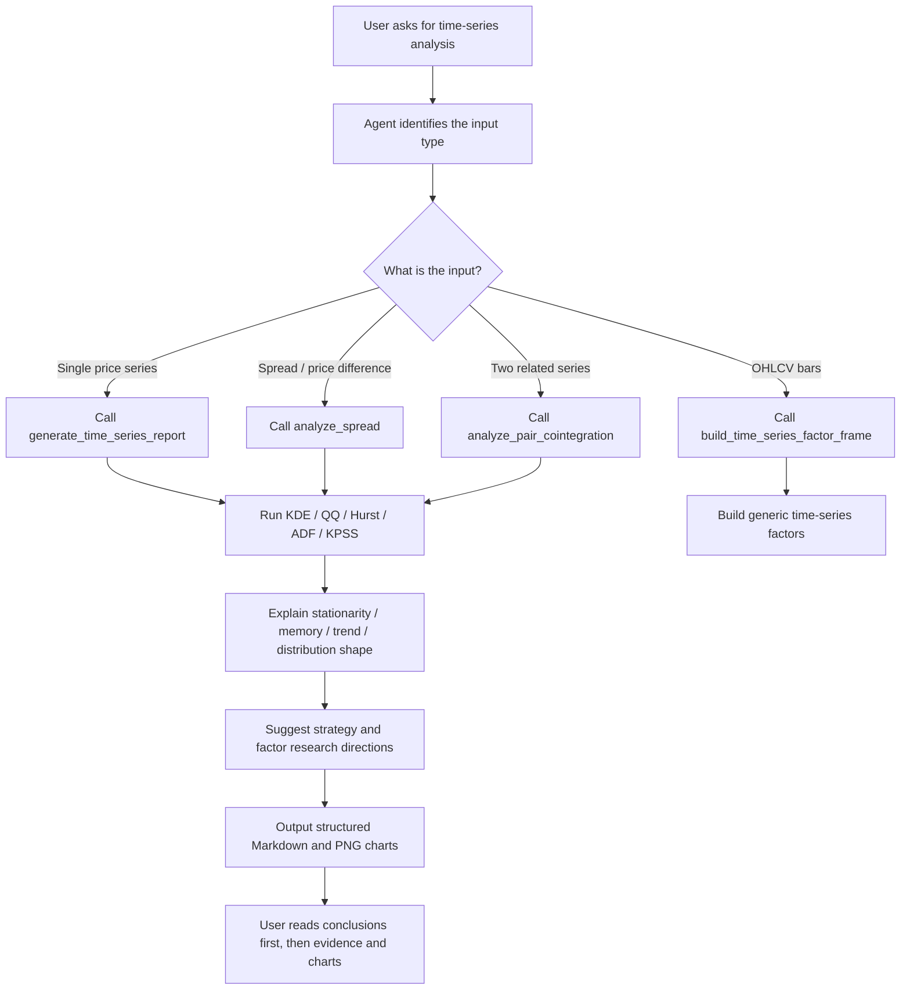

# skill-time-series-analysis

[简体中文](README.md) | English

This is a time-series analysis tool for AI agents and quantitative researchers.
It provides Python APIs for price-series diagnostics, spread analysis,
Engle-Granger cointegration, and mean-reversion half-life, and it can generate
Markdown reports that explain the conclusion first and then show the evidence.

## Example Visualization And Summary

The example below is generated from
`reports/panda_data_futures/multi_symbol_futures_timeseries.md`. It uses real
PandaData futures daily bars for `IF_DOMINANT.CFE`, `CU_DOMINANT.SHF`, and
`I_DOMINANT.DCE`.

| symbol | n_obs | trend_type | tail | skew |
| --- | ---: | --- | --- | --- |
| `IF_DOMINANT.CFE` | 242 | strong trend, non-stationary (trend strategies) | fat_tail | right_skew |
| `CU_DOMINANT.SHF` | 242 | weak trend or counter-trend | fat_tail | symmetric |
| `I_DOMINANT.DCE` | 242 | weak trend or counter-trend | fat_tail | right_skew |

Example conclusion for `IF_DOMINANT.CFE`:

- Stationarity: ADF does not reject a unit root and KPSS rejects stationarity, so the latest window looks trend non-stationary.
- Memory: Hurst is elevated, indicating persistence and directional continuation.
- Trend: the latest window is classified as strong trend and trend non-stationary from the Hurst, ADF, and KPSS combination.
- Research directions: trend following, time-series momentum, breakout confirmation, trend-state filters, and tail-risk filters.


`OHLCV bars` means a time-indexed `open/high/low/close/volume` table for one
instrument. A `generic time-series factor` is a reusable research feature
computed only from that instrument's own historical OHLCV bars; it is not a
trading signal. `build_time_series_factor_frame` outputs:

| Factor | Meaning | Typical Use |
| --- | --- | --- |
| `momentum` | Trailing lookback return | Trend and momentum research |
| `volatility` | Rolling return volatility | Risk filters and position budgets |
| `trend_slope` | Rolling log-price slope | Trend strength detection |
| `mean_reversion_zscore` | Negative price z-score versus rolling mean | Mean-reversion and deviation repair research |

## Workflow



## Quick Start

```bash
uv run python -m pytest tests/ -q
uv run ruff check .
```

```python
from skill_time_series_analysis import generate_time_series_report

report = generate_time_series_report(
    price,
    series_name="demo",
    windows=[60, 120, 180],
    lags=[1, 5, 20],
    output_dir="reports/demo",
)
print(report.to_markdown())
```

## Real-Data Example Report

The repository keeps one PandaData multi-symbol futures analysis report:

- Report entry: `reports/panda_data_futures/multi_symbol_futures_timeseries.md`
- Generating test: `tests/test_panda_data_futures_report.py`
- Data source: PandaData `get_market_data(type="future")`
- Symbols: `IF_DOMINANT.CFE`, `CU_DOMINANT.SHF`, `I_DOMINANT.DCE`

Regenerate the report with PandaData credentials:

```bash
PANDA_DATA_ENV_FILE=/path/to/.env \
  uv run python -m pytest tests/test_panda_data_futures_report.py -q
```

The `.env` file should define `PANDA_DATA_USERNAME` and `PANDA_DATA_PASSWORD`.
The integration test skips when credentials or the SDK are unavailable; the
runtime Python package itself does not depend on PandaData.

## Public API Pyramid

Use top-level APIs first:

- `generate_time_series_report`
- `interpret_time_series_analysis`
- `analyze_price_series`
- `analyze_spread`
- `analyze_pair_cointegration`
- `build_time_series_factor_frame`

Use diagnostics APIs when composing custom workflows:

- `distribution_diagnostics`
- `stationarity_diagnostics`
- `mean_reversion_diagnostics`
- `cointegration_diagnostics`

Low-level helpers remain available for advanced use:

- `kde_analysis`, `qq_analysis`, `ts_groupby_period`
- `TimeSeriesAnalyzer`, `analysis_results_to_df`
- `half_life_of_mean_reversion`, `engle_granger_cointegration`
- `ts_momentum`, `ts_volatility`, `ts_trend_slope`, `ts_mean_reversion_zscore`

## Boundary

The runtime package does not include strategy generation, ML, triple-barrier
labels, backtesting, a PandaData client, or market-data management.
`tests/test_panda_data_futures_report.py` is an optional real-data integration
example that demonstrates the API on external futures bars. Outputs are research
diagnostics, not investment advice or trading signals.
