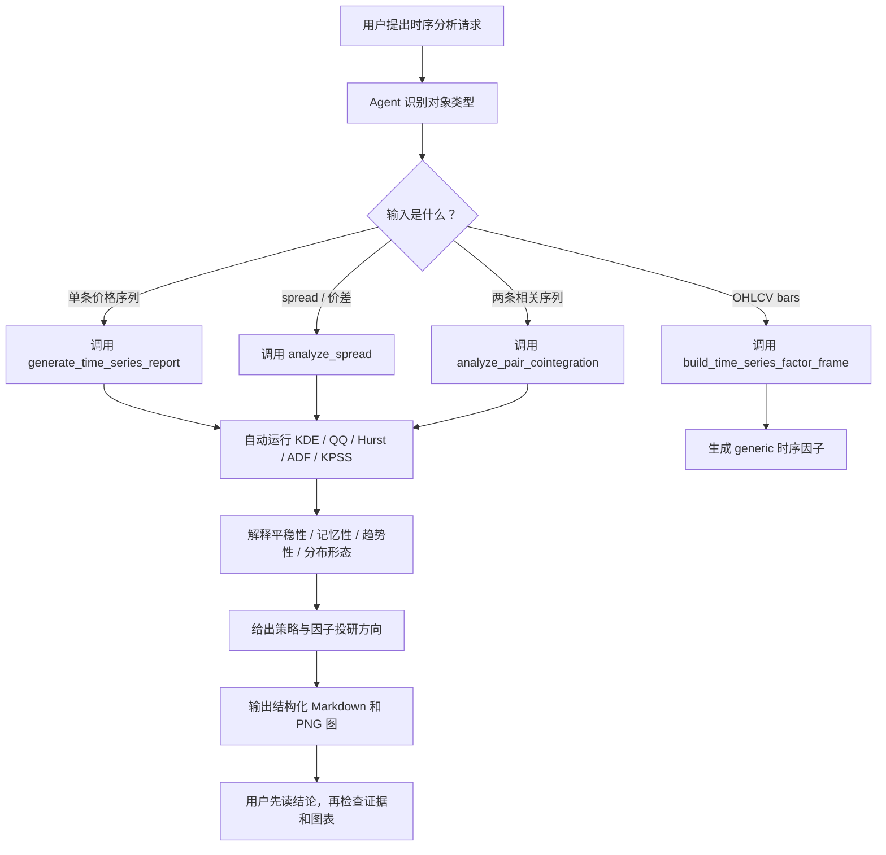

# skill-time-series-analysis

简体中文 | [English](README.en.md)

这是一个给 AI agent 和量化研究者使用的时序分析工具。它可以直接通过 Python API
分析价格序列、spread、双序列协整和均值回复半衰期，也可以自动生成先给结论、再展开
证据的 Markdown 检测报告。

## 案例可视化与总结

下面的案例来自 `reports/panda_data_futures/multi_symbol_futures_timeseries.md`，
使用 PandaData 真实期货日线，对 `IF_DOMINANT.CFE`、`CU_DOMINANT.SHF` 和
`I_DOMINANT.DCE` 生成自动时序检测报告。

| symbol | n_obs | trend_type | tail | skew |
| --- | ---: | --- | --- | --- |
| `IF_DOMINANT.CFE` | 242 | strong trend, non-stationary (trend strategies) | fat_tail | right_skew |
| `CU_DOMINANT.SHF` | 242 | weak trend or counter-trend | fat_tail | symmetric |
| `I_DOMINANT.DCE` | 242 | weak trend or counter-trend | fat_tail | right_skew |

`IF_DOMINANT.CFE` 的报告结论示例：

- 平稳性分析：ADF 未拒绝单位根、KPSS 拒绝平稳假设，整体更像趋势非平稳序列。
- 记忆性分析：Hurst 较高，显示较强持续性，价格变化更容易沿原方向延续。
- 趋势性分析：基于 Hurst、ADF 和 KPSS 的组合判断，最新窗口属于强趋势、趋势非平稳状态。
- 投研方向：趋势跟随、时间序列动量、突破确认、趋势状态识别、尾部风险过滤。


这里的 `OHLCV bars` 指单个品种按时间排列的 `open/high/low/close/volume`
行情表。`generic 时序因子` 指只使用该品种自身历史 OHLCV 计算出来的通用研究特征，
不是交易信号。例如 `build_time_series_factor_frame` 会生成：

| 因子 | 含义 | 典型用途 |
| --- | --- | --- |
| `momentum` | 过去 lookback 周期收益 | 趋势/动量研究 |
| `volatility` | 滚动收益波动率 | 风险过滤、仓位预算 |
| `trend_slope` | 滚动 log price 斜率 | 趋势强度识别 |
| `mean_reversion_zscore` | 价格相对滚动均值的反向 z-score | 均值回复/偏离修复研究 |

## 工作流



## 快速开始

```bash
uv run python -m pytest tests/ -q
uv run ruff check .
```

```python
from skill_time_series_analysis import generate_time_series_report

report = generate_time_series_report(
    price,
    series_name="demo",
    windows=[60, 120, 180],
    lags=[1, 5, 20],
    output_dir="reports/demo",
)
print(report.to_markdown())
```

## 真实数据示例报告

项目保留一个 PandaData 多品种期货时序分析示例报告：

- 报告入口：`reports/panda_data_futures/multi_symbol_futures_timeseries.md`
- 生成测试：`tests/test_panda_data_futures_report.py`
- 数据源：PandaData `get_market_data(type="future")`
- 品种：`IF_DOMINANT.CFE`, `CU_DOMINANT.SHF`, `I_DOMINANT.DCE`

重新生成报告需要 PandaData 凭据：

```bash
PANDA_DATA_ENV_FILE=/path/to/.env \
  uv run python -m pytest tests/test_panda_data_futures_report.py -q
```

`.env` 文件中应包含 `PANDA_DATA_USERNAME` 和 `PANDA_DATA_PASSWORD`。
没有凭据或 SDK 时，该 integration 测试会跳过；Python 包本身不依赖 PandaData。

## Public API

先用高层主入口：

- `generate_time_series_report`
- `interpret_time_series_analysis`
- `analyze_price_series`
- `analyze_spread`
- `analyze_pair_cointegration`
- `build_time_series_factor_frame`

需要自定义工作流时，再用可组合诊断 API：

- `distribution_diagnostics`
- `stationarity_diagnostics`
- `mean_reversion_diagnostics`
- `cointegration_diagnostics`

底层 helper 仅用于高级场景：

- `kde_analysis`, `qq_analysis`, `ts_groupby_period`
- `TimeSeriesAnalyzer`, `analysis_results_to_df`
- `half_life_of_mean_reversion`, `engle_granger_cointegration`
- `ts_momentum`, `ts_volatility`, `ts_trend_slope`, `ts_mean_reversion_zscore`

## 边界

v1 运行包不包含策略生成、机器学习、三重屏障标签、回测、PandaData 客户端或市场数据
管理。`tests/test_panda_data_futures_report.py` 只是可选的真实数据 integration 示例，用
来证明 API 能处理外部期货行情。输出仅用于研究诊断，不构成投资建议或交易信号。
