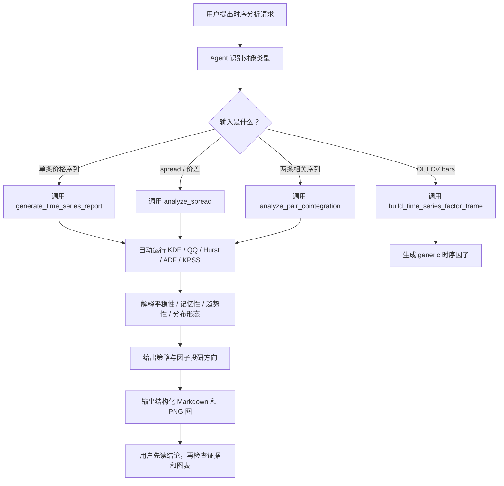

# skill-time-series-analysis

简体中文 | [English](README.en.md)

面向 AI agent 的 hybrid runnable skill：先输出时序诊断结论，再展开证据。内置
Python API 可分析价格序列、spread、双序列协整、均值回复半衰期，以及四个 generic
time-series factor 示例。

## 工作流



## 快速开始

```bash
uv run python -m pytest tests/ -q
uv run ruff check .
```

```python
from skill_time_series_analysis import generate_time_series_report

report = generate_time_series_report(
    price,
    series_name="demo",
    windows=[60, 120, 180],
    lags=[1, 5, 20],
    output_dir="reports/demo",
)
print(report.to_markdown())
```

## 真实数据示例报告

项目保留一个 PandaData 多品种期货时序分析示例报告：

- 报告入口：`reports/panda_data_futures/multi_symbol_futures_timeseries.md`
- 生成测试：`tests/test_panda_data_futures_report.py`
- 数据源：PandaData `get_market_data(type="future")`
- 品种：`IF_DOMINANT.CFE`, `CU_DOMINANT.SHF`, `I_DOMINANT.DCE`

重新生成报告需要 PandaData 凭据：

```bash
PANDA_DATA_ENV_FILE=/path/to/.env \
  uv run python -m pytest tests/test_panda_data_futures_report.py -q
```

`.env` 文件中应包含 `PANDA_DATA_USERNAME` 和 `PANDA_DATA_PASSWORD`。
没有凭据或 SDK 时，该 integration 测试会跳过；Python 包本身不依赖 PandaData。

## Public API

先用高层主入口：

- `generate_time_series_report`
- `interpret_time_series_analysis`
- `analyze_price_series`
- `analyze_spread`
- `analyze_pair_cointegration`
- `build_time_series_factor_frame`

需要自定义工作流时，再用可组合诊断 API：

- `distribution_diagnostics`
- `stationarity_diagnostics`
- `mean_reversion_diagnostics`
- `cointegration_diagnostics`

底层 helper 仅用于高级场景：

- `kde_analysis`, `qq_analysis`, `ts_groupby_period`
- `TimeSeriesAnalyzer`, `analysis_results_to_df`
- `half_life_of_mean_reversion`, `engle_granger_cointegration`
- `ts_momentum`, `ts_volatility`, `ts_trend_slope`, `ts_mean_reversion_zscore`

## 边界

v1 运行包不包含策略生成、机器学习、三重屏障标签、回测、PandaData 客户端或市场数据
管理。`tests/test_panda_data_futures_report.py` 只是可选的真实数据 integration 示例，用
来证明 API 能处理外部期货行情。输出仅用于研究诊断，不构成投资建议或交易信号。
