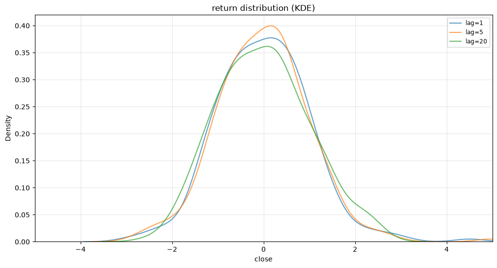
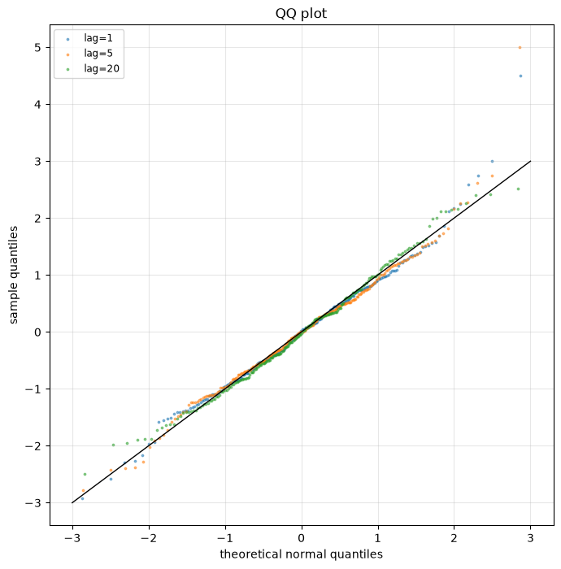

# I_DOMINANT.DCE 自动时序检测报告

## 一句话结论

该序列的检测信号并不单一，适合先做状态识别和风险过滤，再决定具体投研方向。

## 时间序列性质

### 平稳性分析

ADF p-value=0.3603 未拒绝单位根，KPSS p-value=0.0100 拒绝平稳假设，整体更像趋势非平稳序列。

### 记忆性分析

Hurst=0.4400，显示反持续性，序列更接近均值回复或震荡修复。

### 趋势性分析

最新窗口被分类为 `weak trend or counter-trend`，趋势性不够明确，应谨慎使用单一趋势假设。

### 分布形态分析

KDE/QQ 显示主要尾部特征为 `fat_tail`，偏度特征为 `right_skew`，最大 QQ 偏离约为 0.1589。这说明分布形态会影响止损、仓位和风险预算设计。

## 量化投研建议

### 策略方向

- 适合进一步研究多状态过滤、趋势与反转切换、低置信度环境下的仓位控制等投研方向。
- 收益分布存在厚尾特征时，可补充波动率目标、尾部风险过滤和极端行情压力测试。

### 因子方向

- 均值回复类因子：滚动 z-score、布林带偏离、短期反转和残差回归速度。
- 风险类因子：尾部波动、QQ 偏离、极端收益频率和下行波动。
- 分布类因子：收益偏度、偏度变化和非对称风险暴露。

## 检测证据

### Stationarity / Hurst / ADF / KPSS

| window_size | hurst | adf_pvalue | kpss_pvalue | trend_type | min_lag | effective_max_lag | kpss_warning |
| --- | --- | --- | --- | --- | --- | --- | --- |
| 60 | 0.8115 | 0.0675 | 0.1000 | conflicting signals (verify further) | 10 | 20 | The test statistic is outside of the range of p-values available in the look-up table. The actual p-value is greater than the p-value returned.  |
| 120 | 0.5465 | 0.1320 | 0.0100 | weak trend or counter-trend | 20 | 40 | The test statistic is outside of the range of p-values available in the look-up table. The actual p-value is smaller than the p-value returned.  |
| 180 | 0.4400 | 0.3603 | 0.0100 | weak trend or counter-trend | 30 | 60 | The test statistic is outside of the range of p-values available in the look-up table. The actual p-value is smaller than the p-value returned.  |

### KDE / QQ

#### KDE Diagnostics

| index | peak_height | peak_position | num_peaks | tail_feature | skew_feature | statistical_kurtosis | statistical_skewness |
| --- | --- | --- | --- | --- | --- | --- | --- |
| 1 | 0.3775 | 0.1652 | 1 | fat_tail | right_skew | 1.5161 | 0.4007 |
| 5 | 0.3998 | 0.1552 | 1 | fat_tail | right_skew | 2.2166 | 0.4626 |
| 20 | 0.3617 | 0.0751 | 1 | near_normal | right_skew | -0.3578 | 0.2215 |

#### QQ Diagnostics

| index | kurtosis | skewness | qq_deviation |
| --- | --- | --- | --- |
| 1 | 1.5161 | 0.4007 | 0.1387 |
| 5 | 2.2166 | 0.4626 | 0.1589 |
| 20 | -0.3578 | 0.2215 | 0.0875 |

## 图表

### KDE

### QQ

## 注意事项

- 这些检测结果用于确定投研方向，不能直接作为下单依据。
- 厚尾分布意味着极端波动更常见，后续研究需要单独评估尾部风险。
