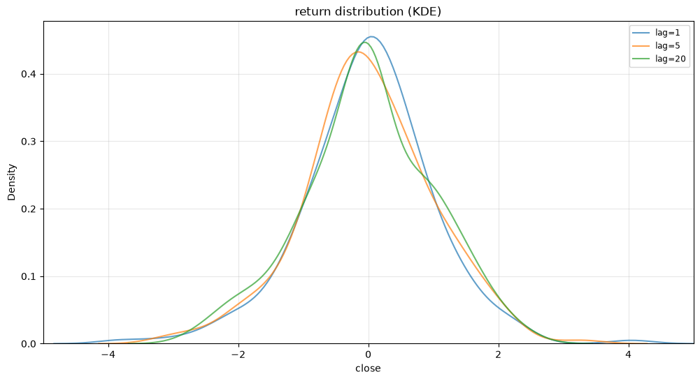
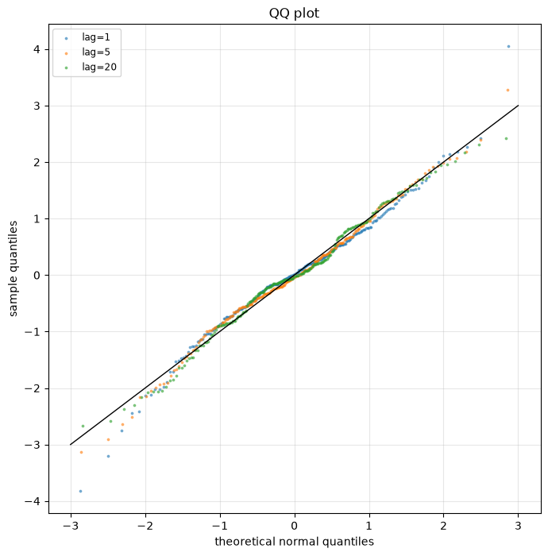

# PandaData Futures Time-Series Analysis

- Data source: PandaData `get_market_data`, type=`future`.
- Date range: `20240101` to `20241231`.
- Symbols: `IF_DOMINANT.CFE`, `CU_DOMINANT.SHF`, `I_DOMINANT.DCE`.

## Cross-Symbol Summary

| symbol | n_obs | trend_type | tail | skew |
| --- | --- | --- | --- | --- |
| IF_DOMINANT.CFE | 242 | strong trend, non-stationary (trend strategies) | fat_tail | right_skew |
| CU_DOMINANT.SHF | 242 | weak trend or counter-trend | fat_tail | symmetric |
| I_DOMINANT.DCE | 242 | weak trend or counter-trend | fat_tail | right_skew |

## IF_DOMINANT.CFE 完整检测结果

### IF_DOMINANT.CFE 自动时序检测报告

## 一句话结论

该序列呈现较明显的趋势性和非平稳特征，优先作为趋势类投研方向的候选对象。

## 时间序列性质

### 平稳性分析

ADF p-value=0.5294 未拒绝单位根，KPSS p-value=0.0100 拒绝平稳假设，整体更像趋势非平稳序列。

### 记忆性分析

Hurst=0.7248，显示较强的持续性和记忆性，价格变化更容易沿原方向延续。

### 趋势性分析

最新窗口被分类为 `strong trend, non-stationary (trend strategies)`，这是由 Hurst=0.7248、ADF p-value=0.5294 和 KPSS p-value=0.0100 共同判断出的趋势性证据，适合先从趋势状态切入。

### 分布形态分析

KDE/QQ 显示主要尾部特征为 `fat_tail`，偏度特征为 `right_skew`，最大 QQ 偏离约为 0.5375。这说明分布形态会影响止损、仓位和风险预算设计。

## 量化投研建议

### 策略方向

- 适合进一步研究趋势跟随、时间序列动量、突破确认和趋势状态识别等投研方向。
- 收益分布存在厚尾特征时，可补充波动率目标、尾部风险过滤和极端行情压力测试。

### 因子方向

- 趋势类因子：滚动收益、均线斜率、价格通道位置、趋势强度和突破持续性。
- 风险类因子：尾部波动、QQ 偏离、极端收益频率和下行波动。
- 分布类因子：收益偏度、偏度变化和非对称风险暴露。

## 检测证据

### Stationarity / Hurst / ADF / KPSS

| window_size | hurst | adf_pvalue | kpss_pvalue | trend_type | min_lag | effective_max_lag | kpss_warning |
| --- | --- | --- | --- | --- | --- | --- | --- |
| 60 | 0.7213 | 0.0159 | 0.1000 | trending but stationary (short-term trend possible) | 10 | 20 | The test statistic is outside of the range of p-values available in the look-up table. The actual p-value is greater than the p-value returned.  |
| 120 | 0.7538 | 0.6333 | 0.0331 | strong trend, non-stationary (trend strategies) | 20 | 40 |  |
| 180 | 0.7248 | 0.5294 | 0.0100 | strong trend, non-stationary (trend strategies) | 30 | 60 | The test statistic is outside of the range of p-values available in the look-up table. The actual p-value is smaller than the p-value returned.  |

## Log Diff 分析

除原始价格序列外，报告还分析 `log(price).diff(lag)` 后的时间序列；这里以 Log diff 1/5/10 为例观察不同持有尺度上的平稳性、记忆性和分布形态。

| lag | label | n_obs | hurst | adf_pvalue | kpss_pvalue | trend_type | tail_feature | skew_feature | kurtosis | skewness | qq_deviation |
| --- | --- | --- | --- | --- | --- | --- | --- | --- | --- | --- | --- |
| 1 | Log diff 1 | 241 | 0.7272 | 0.0000 | 0.1000 | trending but stationary (short-term trend possible) | fat_tail | right_skew | 10.7425 | 0.9351 | 0.4255 |
| 5 | Log diff 5 | 237 | 0.7083 | 0.0034 | 0.1000 | trending but stationary (short-term trend possible) | fat_tail | right_skew | 17.2617 | 3.2085 | 0.5375 |
| 10 | Log diff 10 | 232 | 0.7904 | 0.0607 | 0.1000 | conflicting signals (verify further) | fat_tail | right_skew | 11.0120 | 2.8814 | 0.5448 |

### Log Diff KDE / QQ

#### Log Diff KDE Diagnostics

| lag | label | n_obs | peak_height | peak_position | num_peaks | tail_feature | skew_feature | statistical_kurtosis | statistical_skewness |
| --- | --- | --- | --- | --- | --- | --- | --- | --- | --- |
| 1 | Log diff 1 | 241 | 0.5808 | -0.1351 | 2 | fat_tail | right_skew | 10.7425 | 0.9351 |
| 5 | Log diff 5 | 237 | 0.5871 | -0.1652 | 2 | fat_tail | right_skew | 17.2617 | 3.2085 |
| 10 | Log diff 10 | 232 | 0.6356 | -0.3153 | 2 | fat_tail | right_skew | 11.0120 | 2.8814 |

#### Log Diff QQ Diagnostics

| lag | label | n_obs | kurtosis | skewness | qq_deviation |
| --- | --- | --- | --- | --- | --- |
| 1 | Log diff 1 | 241 | 10.7425 | 0.9351 | 0.4255 |
| 5 | Log diff 5 | 237 | 17.2617 | 3.2085 | 0.5375 |
| 10 | Log diff 10 | 232 | 11.0120 | 2.8814 | 0.5448 |

### KDE / QQ

#### KDE Diagnostics

| index | peak_height | peak_position | num_peaks | tail_feature | skew_feature | statistical_kurtosis | statistical_skewness |
| --- | --- | --- | --- | --- | --- | --- | --- |
| 1 | 0.5808 | -0.1351 | 2 | fat_tail | right_skew | 10.7425 | 0.9351 |
| 5 | 0.5871 | -0.1652 | 2 | fat_tail | right_skew | 17.2617 | 3.2085 |
| 20 | 0.5686 | -0.4955 | 2 | fat_tail | right_skew | 2.3922 | 1.6753 |

#### QQ Diagnostics

| index | kurtosis | skewness | qq_deviation |
| --- | --- | --- | --- |
| 1 | 10.7425 | 0.9351 | 0.4255 |
| 5 | 17.2617 | 3.2085 | 0.5375 |
| 20 | 2.3922 | 1.6753 | 0.4419 |

## 图表

### KDE

### QQ

## 注意事项

- 这些检测结果用于确定投研方向，不能直接作为下单依据。
- 厚尾分布意味着极端波动更常见，后续研究需要单独评估尾部风险。

## CU_DOMINANT.SHF 完整检测结果

### CU_DOMINANT.SHF 自动时序检测报告

## 一句话结论

该序列的检测信号并不单一，适合先做状态识别和风险过滤，再决定具体投研方向。

## 时间序列性质

### 平稳性分析

ADF p-value=0.5097 未拒绝单位根，KPSS p-value=0.0225 拒绝平稳假设，整体更像趋势非平稳序列。

### 记忆性分析

Hurst=0.5496，接近随机游走区间，单独依赖记忆性证据需要谨慎。

### 趋势性分析

最新窗口被分类为 `weak trend or counter-trend`，趋势性不够明确，应谨慎使用单一趋势假设。

### 分布形态分析

KDE/QQ 显示主要尾部特征为 `fat_tail`，偏度特征为 `symmetric`，最大 QQ 偏离约为 0.1514。这说明分布形态会影响止损、仓位和风险预算设计。

## 量化投研建议

### 策略方向

- 适合进一步研究多状态过滤、趋势与反转切换、低置信度环境下的仓位控制等投研方向。
- 收益分布存在厚尾特征时，可补充波动率目标、尾部风险过滤和极端行情压力测试。

### 因子方向

- 状态识别类因子：Hurst 状态、波动分位、ADF/KPSS 组合标签和 regime filter。
- 风险类因子：尾部波动、QQ 偏离、极端收益频率和下行波动。

## 检测证据

### Stationarity / Hurst / ADF / KPSS

| window_size | hurst | adf_pvalue | kpss_pvalue | trend_type | min_lag | effective_max_lag | kpss_warning |
| --- | --- | --- | --- | --- | --- | --- | --- |
| 60 | 0.7389 | 0.4414 | 0.0499 | strong trend, non-stationary (trend strategies) | 10 | 20 |  |
| 120 | 0.5923 | 0.1036 | 0.0476 | strong trend, non-stationary (trend strategies) | 20 | 40 |  |
| 180 | 0.5496 | 0.5097 | 0.0225 | weak trend or counter-trend | 30 | 60 |  |

## Log Diff 分析

除原始价格序列外，报告还分析 `log(price).diff(lag)` 后的时间序列；这里以 Log diff 1/5/10 为例观察不同持有尺度上的平稳性、记忆性和分布形态。

| lag | label | n_obs | hurst | adf_pvalue | kpss_pvalue | trend_type | tail_feature | skew_feature | kurtosis | skewness | qq_deviation |
| --- | --- | --- | --- | --- | --- | --- | --- | --- | --- | --- | --- |
| 1 | Log diff 1 | 241 | 0.5547 | 0.0000 | 0.1000 | trending but stationary (short-term trend possible) | fat_tail | symmetric | 1.7606 | -0.1673 | 0.1514 |
| 5 | Log diff 5 | 237 | 0.6781 | 0.0018 | 0.0862 | trending but stationary (short-term trend possible) | near_normal | symmetric | 0.5532 | -0.0892 | 0.0909 |
| 10 | Log diff 10 | 232 | 0.7163 | 0.0648 | 0.0395 | strong trend, non-stationary (trend strategies) | near_normal | symmetric | -0.1750 | -0.0933 | 0.0888 |

### Log Diff KDE / QQ

#### Log Diff KDE Diagnostics

| lag | label | n_obs | peak_height | peak_position | num_peaks | tail_feature | skew_feature | statistical_kurtosis | statistical_skewness |
| --- | --- | --- | --- | --- | --- | --- | --- | --- | --- |
| 1 | Log diff 1 | 241 | 0.4552 | 0.0551 | 1 | fat_tail | symmetric | 1.7606 | -0.1673 |
| 5 | Log diff 5 | 237 | 0.4325 | -0.1552 | 1 | near_normal | symmetric | 0.5532 | -0.0892 |
| 10 | Log diff 10 | 232 | 0.4396 | -0.0350 | 1 | near_normal | symmetric | -0.1750 | -0.0933 |

#### Log Diff QQ Diagnostics

| lag | label | n_obs | kurtosis | skewness | qq_deviation |
| --- | --- | --- | --- | --- | --- |
| 1 | Log diff 1 | 241 | 1.7606 | -0.1673 | 0.1514 |
| 5 | Log diff 5 | 237 | 0.5532 | -0.0892 | 0.0909 |
| 10 | Log diff 10 | 232 | -0.1750 | -0.0933 | 0.0888 |

### KDE / QQ

#### KDE Diagnostics

| index | peak_height | peak_position | num_peaks | tail_feature | skew_feature | statistical_kurtosis | statistical_skewness |
| --- | --- | --- | --- | --- | --- | --- | --- |
| 1 | 0.4552 | 0.0551 | 1 | fat_tail | symmetric | 1.7606 | -0.1673 |
| 5 | 0.4325 | -0.1552 | 1 | near_normal | symmetric | 0.5532 | -0.0892 |
| 20 | 0.4467 | -0.0551 | 1 | near_normal | symmetric | -0.0885 | -0.1466 |

#### QQ Diagnostics

| index | kurtosis | skewness | qq_deviation |
| --- | --- | --- | --- |
| 1 | 1.7606 | -0.1673 | 0.1514 |
| 5 | 0.5532 | -0.0892 | 0.0909 |
| 20 | -0.0885 | -0.1466 | 0.0966 |

## 图表

### KDE

### QQ

## 注意事项

- 这些检测结果用于确定投研方向，不能直接作为下单依据。
- 厚尾分布意味着极端波动更常见，后续研究需要单独评估尾部风险。

## I_DOMINANT.DCE 完整检测结果

### I_DOMINANT.DCE 自动时序检测报告

## 一句话结论

该序列的检测信号并不单一，适合先做状态识别和风险过滤，再决定具体投研方向。

## 时间序列性质

### 平稳性分析

ADF p-value=0.3603 未拒绝单位根，KPSS p-value=0.0100 拒绝平稳假设，整体更像趋势非平稳序列。

### 记忆性分析

Hurst=0.4400，显示反持续性，序列更接近均值回复或震荡修复。

### 趋势性分析

最新窗口被分类为 `weak trend or counter-trend`，趋势性不够明确，应谨慎使用单一趋势假设。

### 分布形态分析

KDE/QQ 显示主要尾部特征为 `fat_tail`，偏度特征为 `right_skew`，最大 QQ 偏离约为 0.1589。这说明分布形态会影响止损、仓位和风险预算设计。

## 量化投研建议

### 策略方向

- 适合进一步研究多状态过滤、趋势与反转切换、低置信度环境下的仓位控制等投研方向。
- 收益分布存在厚尾特征时，可补充波动率目标、尾部风险过滤和极端行情压力测试。

### 因子方向

- 均值回复类因子：滚动 z-score、布林带偏离、短期反转和残差回归速度。
- 风险类因子：尾部波动、QQ 偏离、极端收益频率和下行波动。
- 分布类因子：收益偏度、偏度变化和非对称风险暴露。

## 检测证据

### Stationarity / Hurst / ADF / KPSS

| window_size | hurst | adf_pvalue | kpss_pvalue | trend_type | min_lag | effective_max_lag | kpss_warning |
| --- | --- | --- | --- | --- | --- | --- | --- |
| 60 | 0.8115 | 0.0675 | 0.1000 | conflicting signals (verify further) | 10 | 20 | The test statistic is outside of the range of p-values available in the look-up table. The actual p-value is greater than the p-value returned.  |
| 120 | 0.5465 | 0.1320 | 0.0100 | weak trend or counter-trend | 20 | 40 | The test statistic is outside of the range of p-values available in the look-up table. The actual p-value is smaller than the p-value returned.  |
| 180 | 0.4400 | 0.3603 | 0.0100 | weak trend or counter-trend | 30 | 60 | The test statistic is outside of the range of p-values available in the look-up table. The actual p-value is smaller than the p-value returned.  |

## Log Diff 分析

除原始价格序列外，报告还分析 `log(price).diff(lag)` 后的时间序列；这里以 Log diff 1/5/10 为例观察不同持有尺度上的平稳性、记忆性和分布形态。

| lag | label | n_obs | hurst | adf_pvalue | kpss_pvalue | trend_type | tail_feature | skew_feature | kurtosis | skewness | qq_deviation |
| --- | --- | --- | --- | --- | --- | --- | --- | --- | --- | --- | --- |
| 1 | Log diff 1 | 241 | 0.4458 | 0.0000 | 0.1000 | mean-reverting stationary (weak for trend) | fat_tail | right_skew | 1.5161 | 0.4007 | 0.1387 |
| 5 | Log diff 5 | 237 | 0.4922 | 0.0034 | 0.1000 | mean-reverting stationary (weak for trend) | fat_tail | right_skew | 2.2166 | 0.4626 | 0.1589 |
| 10 | Log diff 10 | 232 | 0.6396 | 0.0534 | 0.0804 | conflicting signals (verify further) | near_normal | right_skew | 0.4077 | 0.6750 | 0.1781 |

### Log Diff KDE / QQ

#### Log Diff KDE Diagnostics

| lag | label | n_obs | peak_height | peak_position | num_peaks | tail_feature | skew_feature | statistical_kurtosis | statistical_skewness |
| --- | --- | --- | --- | --- | --- | --- | --- | --- | --- |
| 1 | Log diff 1 | 241 | 0.3775 | 0.1652 | 1 | fat_tail | right_skew | 1.5161 | 0.4007 |
| 5 | Log diff 5 | 237 | 0.3998 | 0.1552 | 1 | fat_tail | right_skew | 2.2166 | 0.4626 |
| 10 | Log diff 10 | 232 | 0.3974 | -0.3453 | 1 | near_normal | right_skew | 0.4077 | 0.6750 |

#### Log Diff QQ Diagnostics

| lag | label | n_obs | kurtosis | skewness | qq_deviation |
| --- | --- | --- | --- | --- | --- |
| 1 | Log diff 1 | 241 | 1.5161 | 0.4007 | 0.1387 |
| 5 | Log diff 5 | 237 | 2.2166 | 0.4626 | 0.1589 |
| 10 | Log diff 10 | 232 | 0.4077 | 0.6750 | 0.1781 |

### KDE / QQ

#### KDE Diagnostics

| index | peak_height | peak_position | num_peaks | tail_feature | skew_feature | statistical_kurtosis | statistical_skewness |
| --- | --- | --- | --- | --- | --- | --- | --- |
| 1 | 0.3775 | 0.1652 | 1 | fat_tail | right_skew | 1.5161 | 0.4007 |
| 5 | 0.3998 | 0.1552 | 1 | fat_tail | right_skew | 2.2166 | 0.4626 |
| 20 | 0.3617 | 0.0751 | 1 | near_normal | right_skew | -0.3578 | 0.2215 |

#### QQ Diagnostics

| index | kurtosis | skewness | qq_deviation |
| --- | --- | --- | --- |
| 1 | 1.5161 | 0.4007 | 0.1387 |
| 5 | 2.2166 | 0.4626 | 0.1589 |
| 20 | -0.3578 | 0.2215 | 0.0875 |

## 图表

### KDE

### QQ

## 注意事项

- 这些检测结果用于确定投研方向，不能直接作为下单依据。
- 厚尾分布意味着极端波动更常见，后续研究需要单独评估尾部风险。
