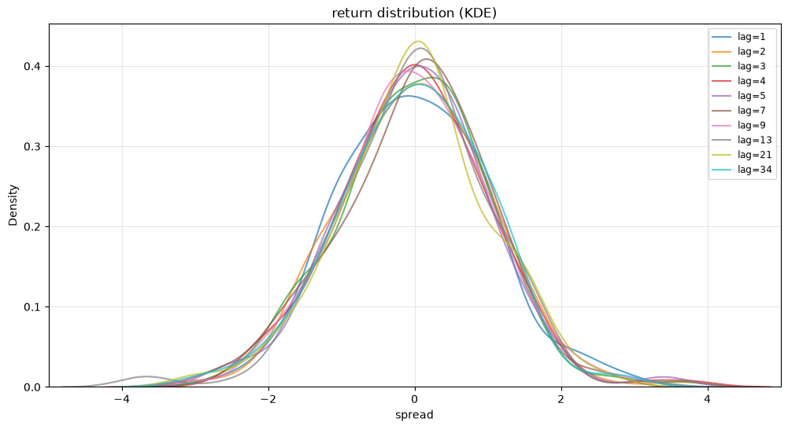
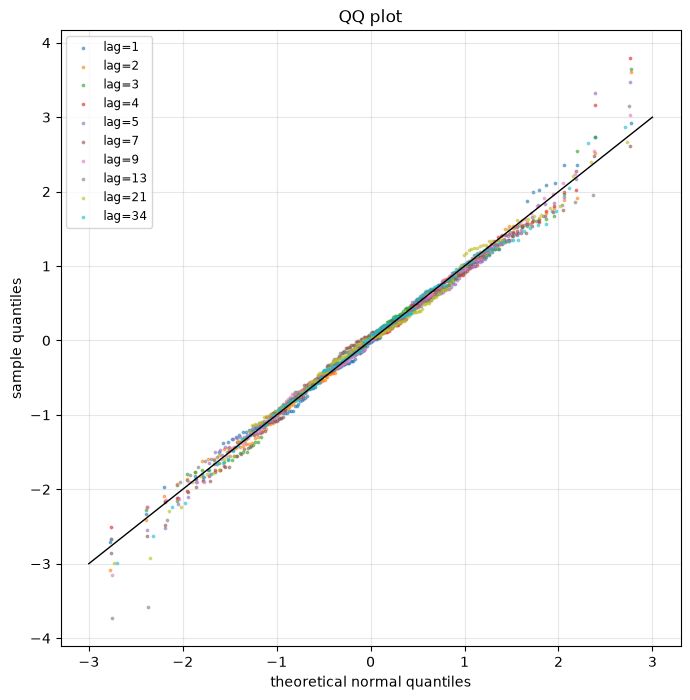

# Demo Spread 价差检测报告

## 一句话结论

该 spread 的半衰期约为 3.07 bars，优先作为价差均值回复投研样本。

## Spread / 价差检测结果

### 半衰期

| Metric | Value |
|---|---:|
| `lambda` | -0.2258 |
| `constant` | -0.0111 |
| `lambda_pvalue` | 0.0000 |
| `half_life_bars` | 3.0700 |
| `is_mean_reverting` | True |
| `r_squared` | 0.1129 |
| `n_obs` | 179 |

### Hurst / ADF / KPSS

最新窗口 Hurst=0.7037，ADF p-value=0.0000，KPSS p-value=0.1000。这些证据用于判断价差是否接近平稳或均值回复过程。

| window_size | hurst | adf_pvalue | kpss_pvalue | trend_type | min_lag | effective_max_lag | kpss_warning |
| --- | --- | --- | --- | --- | --- | --- | --- |
| 60 | 0.7195 | 0.0007 | 0.1000 | trending but stationary (short-term trend possible) | 10 | 20 | The test statistic is outside of the range of p-values available in the look-up table. The actual p-value is greater than the p-value returned.  |
| 120 | 0.7037 | 0.0000 | 0.1000 | trending but stationary (short-term trend possible) | 20 | 40 | The test statistic is outside of the range of p-values available in the look-up table. The actual p-value is greater than the p-value returned.  |

## 量化投研建议

- 适合进一步研究价差 z-score、残差偏离修复、半衰期驱动的持有周期和风险过滤等投研方向。
- 检测结果仅用于筛选研究方向，不能直接作为下单依据。

## 检测证据

### KDE / QQ

#### KDE Diagnostics

| index | peak_height | peak_position | num_peaks | tail_feature | skew_feature | statistical_kurtosis | statistical_skewness |
| --- | --- | --- | --- | --- | --- | --- | --- |
| 1 | 0.3627 | -0.0851 | 1 | near_normal | symmetric | 0.0627 | 0.1870 |
| 2 | 0.3778 | 0.0751 | 1 | near_normal | symmetric | 0.4234 | 0.0593 |
| 3 | 0.3857 | 0.2452 | 1 | near_normal | symmetric | 0.5523 | 0.1184 |
| 4 | 0.4016 | 0.0050 | 1 | near_normal | right_skew | 0.7894 | 0.2436 |
| 5 | 0.3998 | 0.0651 | 2 | near_normal | symmetric | 0.8334 | 0.1488 |
| 7 | 0.4087 | 0.1652 | 1 | near_normal | left_skew | 0.0639 | -0.2679 |
| 9 | 0.3937 | -0.0951 | 1 | near_normal | symmetric | 0.3005 | -0.0073 |
| 13 | 0.4222 | 0.0851 | 2 | fat_tail | left_skew | 1.3317 | -0.3921 |
| 21 | 0.4309 | 0.0551 | 1 | near_normal | symmetric | 0.3207 | -0.1546 |
| 34 | 0.3771 | 0.0651 | 1 | near_normal | symmetric | 0.2667 | -0.1533 |

#### QQ Diagnostics

| index | kurtosis | skewness | qq_deviation |
| --- | --- | --- | --- |
| 1 | 0.0627 | 0.1870 | 0.0793 |
| 2 | 0.4234 | 0.0593 | 0.0872 |
| 3 | 0.5523 | 0.1184 | 0.1050 |
| 4 | 0.7894 | 0.2436 | 0.1127 |
| 5 | 0.8334 | 0.1488 | 0.1116 |
| 7 | 0.0639 | -0.2679 | 0.0939 |
| 9 | 0.3005 | -0.0073 | 0.0606 |
| 13 | 1.3317 | -0.3921 | 0.1487 |
| 21 | 0.3207 | -0.1546 | 0.0946 |
| 34 | 0.2667 | -0.1533 | 0.0817 |

## 图表

### KDE

### QQ

## 注意事项

- spread 构造方式会显著影响半衰期、Hurst、ADF 和 KPSS 结论。
- 样本窗口变化可能改变均值回复判断，实盘前需要独立样本复核。
